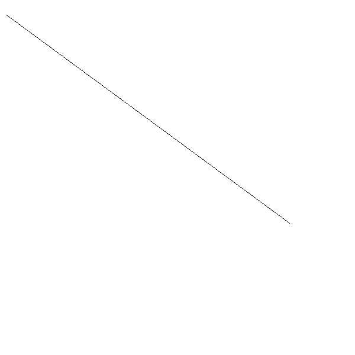

## Task 3

In this task, we will make a program that takes the pixel coordinates of two points in a 600x600 image and draw an line that connects two points.
```
> go run main.go
Input x1: 10
Input y1: 25
Input x2: 490
Input y2: 378 
A straight line from (10, 25) to (490, 378) is draw in 'image.png'.
```
`image.png`:
