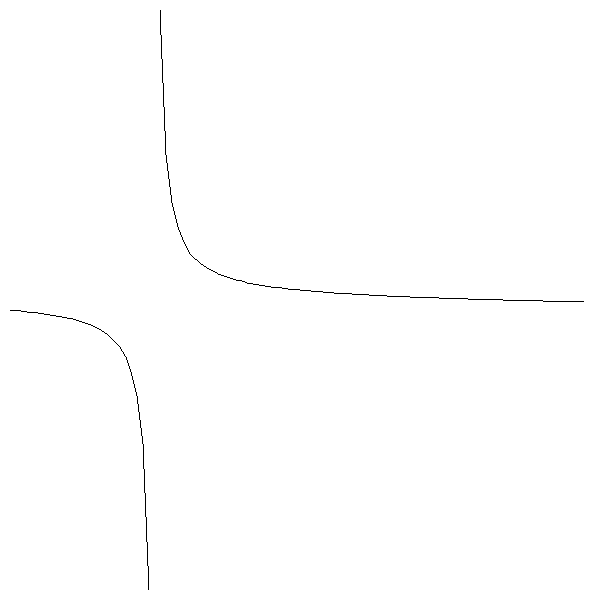

## Task 5

In this task, we will draw the graph of $\sin(x)/(x(x+1))$ on the interval that user inputs.
```
> go run main.go
Input a: -2
Input b: 2
The graph of sin(x)/(x(x+1)) on [-2.000, 2.000] is drawn to `image.png`.% 
>
```
`image.png`
